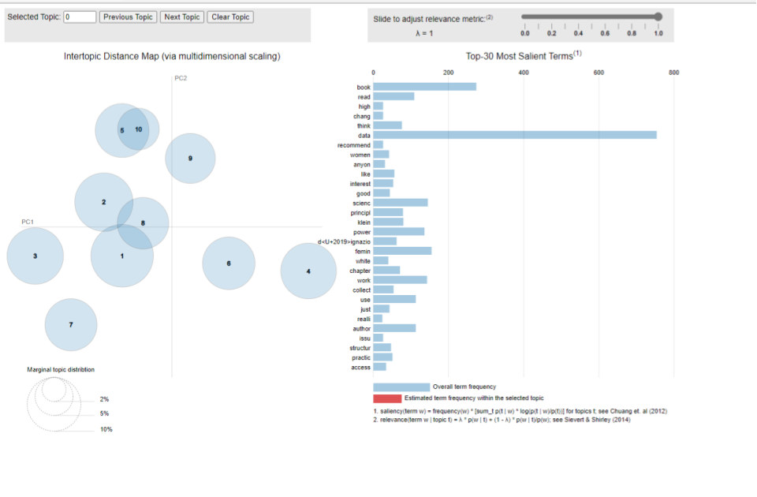

```{r setup, include=FALSE}
knitr::opts_chunk$set(echo = TRUE)
```
## 1 PURPOSE

To inspect book reviews on Data Feminism using a Topic Modleing Technique

### 1a. Motivation and Focus

A few years back, I remember reading a publication by Din-Kariuki (2015) written about feminist initiatives in University. Dan-Kariuki (2015) emphasized the importance of "conversations about race, class, disability, sexuality, and other axes of oppression" within women experiences.
  Kimberlé Crenshaw's 1989 term *intersectionality*  focuses on "the interconnected nature of social categorizations such as race, class, and gender as they apply to a given individual or group, regarded as creating overlapping and interdependent systems of discrimination or disadvantage" (Cooper, 2016). Connecting intersectionality and feminism, Din-Kariuki (2015) states, "as far as sexism is concerned, women from different segments of society are oppressed to different extents and in different ways" grounding that as intersectional feminism.
A new book on feminism has emerged, *Data Feminism* first published on March 16, 2020, by Catherine D'Ignazio and Lauren Klein, set forth seven principles with an intersectional feminist lens to examine unequal power structures in data.

Seven Principles from Data Feminism book:
- Examine power
- Challenge power
- Work towards justice.
- Elevate emotion & embodiment
- Rethink binaries & hierarchies
- Embrace pluralism
- Consider context
- Make labor visible

The authors include literature about and written by members of the LGBTQ+ community, people of color, previously colonized nations, and indigenous communities. Like Dan-Kariuki's (2015) article, Data Feminism highlights that feminism is not only about the female gender and grounded in intersectional feminism. Touting that data feminism isn't only for women but for males, non-binary and genderqueer to use in their work.

After recently completing a N-gram analysis from Twitter hashtags like #DataFemisim, I wanted to learn more about what others might be saying about the book *Data Feminism*. Or even how they might be using the framework in their work. Since the book is relatively new, I wasn't sure a literature review would give me a good sense of *Data Feminism *. I decided to look at book reviews from Amazon, Goodreads, and blogs through a Google search. Guiding my analysis are the following questions:

1. Can we quantify the words between Data Feminism book review sites and are they statistically significant?
2. Can a topic modeling analysis on *Data Feminism* book reviews reveal topics or trends on the framework principles?

	

### 1b. Load Libraries

First, let's load the libraries needed to wrangle, the data. Since we are doing an Unsupervised Machine Learning technique called Topic Modeling we will be using packages specifically for that analysis.


```{r message = FALSE, warning = FALSE}
#Install packages for wrangling
library(dplyr)
library(tidyverse)
library(readr)
library(tidyr)
# install packages for reading data
library(writexl)
library(readxl)
library(tidytext)
library(textdata)
#install Packages for Topic Modleing
library(tm)
library(SnowballC)
library(topicmodels)
library(ldatuning)
library(stm)

# for visualizations
library(ggplot2)
library(scales)
library(wordcloud2)
library(gridExtra) 
library(knitr) 
library(kableExtra) 
library(formattable) 
library(yarrr)  
library(LDAvis)
library(ggrepel)

#define colors to use throughout
my_colors <- c("#E69F00", "#56B4E9", "#009E73", "#CC79A7", "#D55E00", "#D65E00")
#define theme plot used throughout
theme_plot <- function(aticks = element_blank(),
                         pgminor = element_blank(),
                         lt = element_blank(),
                         lp = "none")
{
  theme(plot.title = element_text(hjust = 0.5), #center the title
        axis.ticks = aticks, #set axis ticks to on or off
        panel.grid.minor = pgminor, #turn on or off the minor grid lines
        legend.title = lt, #turn on or off the legend title
        legend.position = lp) #turn on or off the legend
}


```


## 2 Method

### 2a. Webscraping and pulling data to engineered dataset

Using customer reviews as an analysis is not new. Companys use manual and AI analysis of Amazon reviews to help drive change, Bag-of-words approach, and look at term frequencies across all reviews (Bussler, 2021). Looking closely at a Google Search, I found book reviews from Goodreads.com, Amazon.com, and a few online platforms in the form of blogs. The criteria used was that it must denote a book review on only the Data Feminism book. I categorized the blogs into an "other" category; although not copious, the reviews equaled 134.

- Good Reads Reviews: 104
- Amazon book reviews: 22
- Other:               12


I tried a web scraping technique and partial copy and paste for this analysis. To web scrape, I installed *Selector Gadget* an open-source Chrome Extension to quickly identify CSS/Xpath selection. 
I was able to scrape the first page of Goodreads but could not get my loop to work on crawling the other pages. While scraping Goodreads reviews, my script pulled duplicates of some of the reviews, but only the first paragraph and only the first line in some instances.
I used a separate script on the Amazon reviews after collecting the ASIN number. 
I ended up Tidying the data frames in excel since i had to go threw and delete the duplicates manually. 
Finally, I went through the Google Search, looking for Blogs that came up in my search ("Data Feminism" AND "Book Review"). 


```{r eval = FALSE}
### Use Selector gadget to get CSS tags and scrape in the review data for Data Feminism.


#create a link for the HTML to read the Goodreads reviews
link <- "https://www.goodreads.com/en/book/show/51777543-data-feminism"

#save a new object to use and save called page1
page1 <- read_html(link)

#save the names of the reviewers
name <- page1 %>%
  html_nodes(".user") %>%
  html_text()
#save the year the review was created
year <- page1 %>%
  html_nodes(".createdAt") %>%
  html_text()
#save the reviews, it is giving us 58 but we only have 30 observations per page.  
review <- page1 %>%
  html_nodes(".readable span") %>%
  html_text() 

#save review as a tibble/dataframe
pg1_review <- tibble(review)

#create a dataframe with name and year for page1
result_df_p1 <- tibble(name, year)
result_df_p1

#write excel for new tiblle of name and year
write_xlsx(result_df_p1, "data/result_df_p1.xlsx")
result_df_p1<- read_excel("data/result_df_p1.xlsx")
#write excel for results that have 58 and 2 duplicate paragraphs in the data. GOing to fix in excel
write_xlsx(pg1_review, "data/pg1_review.xlsx")

#Use Amazon webscraper to scrape book reviews
scrape_amazon <- function(ASIN, page_num){
  
  url_reviews <- paste0("https://www.amazon.com/product-reviews/",ASIN,"/?pageNumber=",page_num)
  
  doc <- read_html(url_reviews) # Assign results to `doc`
  
  # Review Title
  doc %>% 
    html_nodes("[class='a-size-base a-link-normal review-title a-color-base review-title-content a-text-bold']") %>%
    html_text() -> review_title
  
  # Review Text
  doc %>% 
    html_nodes("[class='a-size-base review-text review-text-content']") %>%
    html_text() -> review_text
  
  # Number of stars in review
  doc %>%
    html_nodes("[data-hook='review-star-rating']") %>%
    html_text() -> review_star
  
  # Return a tibble
  tibble(review_title,
         review_text,
         review_star,
         page = page_num) %>% return()
}


ASIN <- "0262044005" # Specify ASIN
page_range <- 1:10 # Let's say we want to scrape pages 1 to 10

# Create a table that scrambles page numbers using `sample()`
# For randomising page reads!
match_key <- tibble(n = page_range,
                    key = sample(page_range,length(page_range)))

lapply(page_range, function(i){
  j <- match_key[match_key$n==i,]$key
  
  message("Getting page ",i, " of ",length(page_range), "; Actual: page ",j) # Progress bar
  
  Sys.sleep(3) # Take a three second break
  
  if((i %% 3) == 0){ # After every three scrapes... take another two second break
    
    message("Taking a break...") # Prints a 'taking a break' message on your console
    
    Sys.sleep(2) # Take an additional two second break
  }
  scrape_amazon(ASIN = ASIN, page_num = j) # Scrape
}) -> output_list


```

### 2b. Read and Restructure Data

Let's read in the data and only inspect the first two since some of the reviews are a few pages. The data frame looks pretty good and tidy, so there will not be much wrangling of the data. I want to add a unique identifier for later analysis. We see that we have 134 observations with five variables.
We are going to add a unique identifier with rowid_to column() function.

```{r message = FALSE, warning = FALSE}
#read in previously scraped data
df_reviews <- read_excel("data/result_df_p1 (3).xlsx")
df_reviews <- tibble::rowid_to_column(df_reviews, "index") #add unique identifier

df_reviews %>%
  head(n=2)%>%
  kbl(caption = "Restructured Data - tidy_tweets data frame") %>%
  kable_styling(bootstrap_options = c("striped", "hover"))
```

### 2c. Tidy Text format

Next, we will tidy our text using the tidytext and dplyr packages to split the text into tokens creating a table with one token per row. The token is under a column called word(). Another step to tidy the text is to remove the most common stop words such as a, the, is, are, and, etc. As mentioned previously, "art" is commonly connected to Canvas; therefore, we need to filter out "art." We will take another look at the head of our tokenized text.

```{r message = FALSE, warning = FALSE}


#tokenize review words and keep all columns
review_tidy<- df_reviews %>%
  unnest_tokens(word, review) %>%
  anti_join(stop_words)%>%
  select(name, everything()) %>%
  unite(review, site, index)
review_tidy

```
### 2d. Word frequencies

The simplest word frequency analysis assesses the most common words in a text. We can use count to determine the most common words across all the text in the reviews on Data Feminism. Let's quickly look at the word counts and then the frequencies across each site to see if reviewers use the same type of language to evaluate Data Feminism.

We can see that "data," "feminism," and "book" are a few of the most popular words used in the Data Feminism book reviews. This make sense since the book's title is *"Data Feminism"*. 
We also see the authors names and "science" as top words. 


```{r message = FALSE, warning = FALSE}

#show top 10 words across all review sites
review_tidy %>%
  count(word, sort = TRUE) %>%
  filter(n > 70) %>%
  mutate(word = reorder(word, n)) %>%
  ggplot(aes(n, word)) +
  geom_col() +
  labs(y = NULL)


```

Before we go on, let us also get a better sense of how the word 'people is being used since it is in our top words. Wow, we see there are thirty-four reviews with the word people mentioned. Since many are long, let's inspect three reviews using ggrepl().

The first review proposes clarity for parameters and variables of measurment siting, *"I think we should consider what blindspots we may have, especially when doing research that impacts people and societies."*
The second review questions who the book audience should be stating, *"If it’s people with a background in feminist/intersectionality theory, it’s fundamentally pretty basic info (although the examples used to illustrate them are certainly interesting, albeit a few have that undergrad “I randomly picked something to use as an example in my paper and it’s due tomorrow so we’re just going with it ok” vibe).*
The third review uses people in a broad sense of description from mentions in the book, *"It falls back to a depressingly-liberal theory of change after hitting the nail on the head about all sorts of stuff, even going so far as to quote people that certainly (and correctly) had more radical prescriptions about what to do with all this.*

```{r}

review_tidy_people <- df_reviews %>%
  select(review) %>% 
  filter(grepl('people', review))
 
review_tidy_people %>%
  head(n=3)%>%
  kbl(caption = "Three reviews include the word 'people'") %>%
  kable_styling(bootstrap_options = c("striped", "hover"))
  

```


### 2e-i. Permulation of Word Frequency

Let's compare the word frequencies between Goodreads.com, Amazon.com, and the other category for book reviews.

Words close to the line in the plots have similar frequencies across all the review sites. 

For example, words such as "data," "book," and "D'Ignazio" are relatively common and used with similar frequencies across most of the reviews. Words that are far from the line are found more in one review site than the other. Furthermore, words standing out above the line are shared across the review sites but not within that particular review site. For instance, "science" stands out above the line on the Amazon review site. This means that "science" is reasonably common across the entire review site but is not used as much on the Amazon review site. Words below the line are common in that review site but not across the whole site. The only one sticking out below the bar is on the Amazon site and is the number twelve. 


```{r message = FALSE, warning = FALSE}
# calculate percent of word use across all novels
tf_review<- review_tidy %>%
        anti_join(stop_words) %>%
        count(word) %>%
        transmute(word, all_words = n / sum(n))

# calculate percent of word use within each review
sf_review <- review_tidy %>%
  separate(review, c("site", "index"), 
           sep = "_", convert = TRUE)%>%
        anti_join(stop_words) %>%
        count(site, word) %>%
        mutate(site_words = n / sum(n)) %>%
        left_join(tf_review) %>%
        arrange(desc(site_words)) %>%
        ungroup()

sf_review %>%
  head(n= 10)%>%
  kbl(caption = "Top words and their frequency across each review site ") %>%
  kable_styling(bootstrap_options = c("striped", "hover"))
        
ggplot(sf_review, aes(x = site_words, y = all_words, color = abs(all_words - site_words))) +
        geom_abline(color = "gray40", lty = 2) +
        geom_jitter(alpha = 0.1, size = 2.5, width = 0.3, height = 0.3) +
        geom_text(aes(label = word), check_overlap = TRUE, vjust = 1.5) +
        scale_x_log10(labels = scales::percent_format()) +
        scale_y_log10(labels = scales::percent_format()) +
        scale_color_gradient(limits = c(0, 0.001), low = "darkslategray4", high = "gray75") +
        facet_wrap(~ site, ncol = 2) +
        theme(legend.position="none") +
        labs(y = "Data Feminism Review word frequency", x = NULL)
```

### 2e-ii. Statistical Significance

To answer our first research question, **"Can we quantify the word frequencies used between the sites on Data Feminism book reviews?"** We must look at how correlated the word frequencies between the entire review sites and each separate review site are. We can quantify this with a correlation test to see if the numbers are statistically significant. 

- Looks like high correlations between sites, which are statistically significant at *p <.05*, suggesting that the relationship between the word frequencies is highly similar across the reviews on the review sites.

```{r message = FALSE, warning = FALSE}
sf_review %>%
  group_by(site) %>%
  summarize(correlation = cor(site_words, all_words),
            p_value = cor.test(site_words, all_words)$p.value)
```
### 2f. Document Term Matrix 

To answer our other research questions, we will have to perform an Unsupervised modeling technique *topic modeling* to see if we can understand themes from the book reviews combined.

We will treat each individual review as a unique "document." first, we need to create a *Document Term Matrix (dtm)*. Using the count() function for how many times each word occurs in each document or index in our case. Then create a matrix that contains one row per post as our original data frame did, but now includes a column for each word in the entire corpus and a value of n for how many times that word occurs in each post. I decided to combine the site name, index number and review.

Additionally, I decided to remove the authors names, "book," and the word "authors." We know that these will be prevalent and do not provide new insight for this analysis.

We see that our document term matrix has 133 documents and 3785 terms with a sparsity of 98%. Great!

```{r message = FALSE, warning = FALSE}
# tokenize our reviews text (this is the same step we did in wrangle but don't include every variable)
review_tidy <- df_reviews %>%
  unnest_tokens(output = word, input = review) %>%
  anti_join(stop_words, by = "word") %>%
  select(name, everything()) %>%
  unite(review, site, index)

#my_stop_words
my_stop_words <- bind_rows(stop_words,
                           tibble(word = c("dignazio","d ignazio","d'ignazio","D’Ignazio",
                           "klein", "catherine","book","lauren", "author", "authors",
                           as.character(1:12),lexicon =rep("custom", 30))))
word_counts <- review_tidy %>%
  anti_join(my_stop_words) %>%
  count(review, word, sort = TRUE)%>%
  ungroup()


#create dtm
research_dtm <- word_counts %>%
  count(review, word) %>%
  cast_dtm(review, word, n) %>%
  print()


```


## 3 Model

We need to pull out the topics from each document with our mixture model and try and locate a good K-Means number.

### 3a. Finding K

I do not have a good idea of how many topics might be within the reviews. Bail(2018) notes, "the results of topic models should not be over-interpreted unless the researcher has strong theoretical apriori about the number of topics in a given corpus."

I will try and flesh out topics with a few finding K value techniques:
- **a-i**. n_distinct() function from the dplyr package to find the number of unique site names in our book review data.
- **a-ii**. Use the ldatuning package to calculate and plot the preferable number of topics for the LDA model. 
- **a-iii**. Try the toLDAvis() function, which provides great visualizations for exploring the topic and word distributions using the LDAvis topic browser.

#### **a-i.** The n_distinct method.
The n_distinct () function shows us that there are three unique site names.We divided up our reviews into three categories under the variable "site." I am not sure that three topics will provide much insight. Let us look at two other ways to find topic counts.


```{r message = FALSE, warning = FALSE}
n_distinct(df_reviews$site)
```

#### **a-ii.** ldatuning Package method 
We use the FindTopicsNumber to find topics using the research_dtm for a sequence of 5-50, counting by 5. Trying different sequences gave me the same Griffiths2004 metric results with an inflection point at **10**. Now let's look at the LDAvis method.

```{r message = FALSE, warning = FALSE}
k_metrics <- FindTopicsNumber(
  research_dtm,
  topics = seq(05, 50, by = 5),
  metrics = "Griffiths2004",
  method = "Gibbs",
  control = list(),
  mc.cores = NA,
  return_models = FALSE,
  verbose = FALSE,
  libpath = NULL
)

FindTopicsNumber_plot(k_metrics)
```

#### **a-iii.** LDAvis method

The last technique we will use is the LDAvis visualization, which shows us whether topics are overlapping and by how much. This technique uses the *structured topic model*, First nwe will run the STM unsupervised model before running the LDAvis model. We will use ten as the topic number we got from the Griffiths2014 metric.


```{r message = FALSE, warning = FALSE}

temp <- textProcessor(df_reviews$review, 
                    metadata = df_reviews,  
                    lowercase=TRUE, 
                    removestopwords=TRUE, 
                    removenumbers=TRUE,  
                    removepunctuation=TRUE, 
                    wordLengths=c(3,Inf),
                    stem=TRUE,
                    onlycharacter= FALSE, 
                    striphtml=TRUE, 
                    customstopwords=NULL)

docs <- temp$documents 
meta <- temp$meta 
vocab <- temp$vocab 

review_stm <- stm(documents=docs, 
         data=meta,
         vocab=vocab, 
         prevalence =~ index,
         K=10,
         max.em.its=25,
         verbose = FALSE)

review_stm


```

 

When we run the LDAvis, we can see that there are a few overlapping topics. When I ran higher numbers there was severe overlap within the topics. Here we are not seeing that, which means we should be able to identify topics or themes.

```{r eval = FALSE}

toLDAvis(mod = review_stm, docs = docs)
```


### 3b. Fit LDA model for analysis


I started with K= 10 topics but decided to reduce the number to seven after many attmempts in understanding the topics. Seven seemed to be the most identifiable number.

Let's fit the LDA model with ten topics to a Latent Dirichlet Allocation (LDA) topic modeling technique to extract topics from the corpus.


```{r message = FALSE, warning = FALSE}

k <- 7 #number of topics
seed = 1234 #necessary for reproducibility
#fit the model 
#you could have more control parameters but will just use seed here
review_lda <- LDA(research_dtm, k = k, method = "GIBBS", control = list(seed = seed))


```


## 4 Explore

### 4a. Beta terms

Looking at Beta occurrence for each term we can see some overarching themes. But let's compare this to the STM model as well to see if there are similaritites before "reading the Tea Leaves."


```{r message = FALSE, warning = FALSE}

word_chart <- function(data, input, title) {
  data %>%
  #set y = 1 to just plot one variable and use word as the label
  ggplot(aes(as.factor(row), 1, label = input, fill = factor(topic) )) +
  #you want the words, not the points
  geom_point(color = "transparent") +
  #make sure the labels don't overlap
  geom_label_repel(nudge_x = .1,  
                   direction = "y",
                   box.padding = 0.1,
                   segment.color = "transparent",
                   size = 3) +
  facet_grid(~topic) +
  theme_plot() +
  theme(axis.text.y = element_blank(), axis.text.x = element_blank(),
        #axis.title.x = element_text(size = 9),
        panel.grid = element_blank(), panel.background = element_blank(),
        panel.border = element_rect("lightgray", fill = NA),
        strip.text.x = element_text(size = 8)) +
  labs(x = NULL, y = NULL, title = title) +
    #xlab(NULL) + ylab(NULL) +
  #ggtitle(title) +
  coord_flip()
}


num_words <- 10 #number of words to visualize

#create function that accepts the lda model and num word to display
top_terms_per_topic <- function(lda_model, num_words) {

  #tidy LDA object to get word, topic, and probability (beta)
topics_tidy <- tidy(lda_model, matrix = "beta")

  

  top_terms <- topics_tidy %>%
  group_by(topic) %>%
  arrange(topic, desc(beta)) %>%
  #get the top num_words PER topic
  slice(seq_len(num_words)) %>%
  arrange(topic, beta) %>%
  #row is required for the word_chart() function
  mutate(row = row_number()) %>%
  ungroup() %>%
  #add the word Topic to the topic labels
  mutate(topic = paste("Topic", topic, sep = " "))
  #create a title to pass to word_chart
  title <- paste("LDA Top Terms for", k, "Topics")
  #call the word_chart function 
  word_chart(top_terms, top_terms$term, title)
}
top_terms_per_topic(review_lda, num_words)

```

STM Model

The STM model has a lot of words that we will need to go back and take out. Otherwise the themes here are overlapping and hard to make out. Mainly that we should read the Data Feminism book by D'Ignazio and Klein.
Topic one could have an overarching theme about integrating the practices of intersectional Data Feminism. Which is similar to the topic for number 7 in our LDA model. 
```{r message = FALSE, wasning = FALSE}
temp <- textProcessor(df_reviews$review, 
                    metadata = df_reviews,  
                    lowercase=TRUE, 
                    removestopwords=TRUE, 
                    removenumbers=TRUE,  
                    removepunctuation=TRUE, 
                    wordLengths=c(3,Inf),
                    stem=FALSE,
                    onlycharacter= FALSE, 
                    striphtml=TRUE, 
                    customstopwords=TRUE)

docs <- temp$documents 
meta <- temp$meta 
vocab <- temp$vocab 

review_stm <- stm(documents=docs, 
         data=meta,
         vocab=vocab, 
         prevalence =~ index,
         K=7,
         max.em.its=25,
         verbose = FALSE)

plot(review_stm, type = "summary", xlim = c(0, 0.6), n= 7)

```


### 4b. Investigating term within a topic - Beta

As Siles(2015) explains we will use Beta to tell us the probability of that term being generated from that topic for that document and visualize it. We can see the dominant word "data" is in the book reviews.

```{r message = FALSE, warning = FALSE}
# tidy the lda model
tidy_lda <- tidy(review_lda)
#get the data into top 6 terms
top_terms <- tidy_lda %>%
  group_by(topic)%>%
  slice_max(beta, n = 6, with_ties = FALSE) %>%
  ungroup()%>%
  arrange(topic, -beta)
#visualize top ten terms within each topic
top_terms %>%
  mutate(topic = factor(topic),
         term = reorder_within(term, beta, topic)) %>%
  ggplot(aes(term, beta, fill = log(beta))) +
  geom_bar(stat = "identity", show.legend = FALSE, color= "grey20", size= 0.2) +
  scale_x_reordered() +
  facet_wrap(~ topic, scales = "free", ncol = 3) +
  coord_flip() +
  scale_fill_distiller(palette = "RdYlBu") +
  theme(legend.position = 'none',
        panel.grid = element_blank(),
        axis.text.y = element_text(size= 10),
        axis.text.x = element_blank(),
        plot.margin = margin(0.5, 1, 0.5, 0.5, "cm")) +
  labs(title= "Top 6 terms in each LDA topic", x= (NULL), y= expression(beta))
```

### 4c. Investigate the topics associated with each index number(book review). 

- i. We can do this by looking at the "gamma" probability that each topic belongs in each topic. We can't use the "site"variable because it will not give us the unique reviews. 
After our model has assigned the probability to each of the topics we can visualize the distribution of probabilities to all topics. 


```{r message = FALSE, warning = FALSE}
lda_gamma <- tidy(review_lda, matrix = "gamma")

ggplot(lda_gamma, aes(gamma)) +
  geom_histogram(alpha = 0.8) +
  scale_y_log10() +
  labs(title = "Distribution of probabilities for all topics",
       y = "Number of documents", x = expression(gamma))
```
- ii. Also, we can also visualize how the probabilities are distribution within each individual topic. It looks like *Topic 4* has probablities that do not belong in the topic and none that do. 
We are looking for documents closer to 1 that are discriminate as belonging to a topic or not. Since we do not see that they are sorted nicely we will run a a model that shows how our model did at sorting the topics from each book review site.


```{r message = FALSE, warning = FALSE}

site_gamma <- lda_gamma %>%
  separate(document, c("site", "index"), sep = "_", convert = TRUE)

ggplot(site_gamma, aes(gamma, fill = as.factor(topic))) +
  geom_histogram(alpha = .6, show.legend = FALSE, bins=10) +
  scale_y_log10() +
  facet_wrap(~topic, scales = "free") +
  labs(title = "Distribution of probability for each topic",
       y = "Number of documents", x = expression(gamma))


```

### 4d. 
We can check our per-document-per-topic probabilities to see how well our unsupervised learning did at distinguishing the three site containg book reviews. 

We notice that almost all of the reviews from Amazon, and the blog sites("other") were almost always uniquely identified as a single topic. Ther is some variance but it looks like more reviews from the Goodreads site were somewhat associated with other topics. 

```{r message = FALSE, warning = FALSE}
site_gamma <- lda_gamma %>%
  separate(document, c("site", "index"), sep = "_", convert = TRUE)
# re-rank top topic terms for topic names
site_gamma %>%
  mutate(Site = reorder(site, gamma * topic)) %>%
  ggplot(aes(factor(topic), gamma)) +
  geom_boxplot() +
  facet_wrap(~ site) +
  labs(x = "topic", y = expression(gamma))

```


### 4e. tSNE Clustering Terms in 2-Dimensional Space

Finally lets use a t-SNE (t-distributed stochastic neighbor) model to can see the distance between each topics and which ones tend to cluster together.

We can see that there are several topics clustering together in two main groups.
```{r message = FALSE, warning=FALSE}

topicLabels<- top_terms %>%
  ungroup() %>%
  arrange(topic, desc(beta)) %>%
  group_by(topic)%>% 
  mutate(Order= order(desc(beta))) %>%
  filter(Order < 5) %>%
  summarise(Label= str_c(term, collapse=" ")) %>%
  mutate(topic= str_sub(topic, 7),
         Label= paste0(topic,": ", str_to_sentence(Label)),
         topic= as.numeric(topic)) 

mytSNE<- function(thematrix){
  perplex<- round(sqrt(nrow(thematrix)))
  res<- Rtsne::Rtsne(thematrix, dims= 2, perplexity= 1)
  resdf<- data.frame(x= res$Y[,1], y= res$Y[,2])
  resdf$x<- resdf$x + rnorm(nrow(resdf),0, 0.2)  # Add some noise 
  resdf$y<- resdf$y + rnorm(nrow(resdf),0, 0.2)
  return(resdf)
}

bt<-      review_lda %>% tidy(matrix= "beta") %>% spread(term, beta) 
hc<-      bt %>% dist() %>% hclust(method= "ward.D")

library(dendextend)
library(Rtsne)
library(ggrepel)

tsne<-    mytSNE(bt) %>%
  mutate(text=str_wrap(topicLabels$Label,5), color= cutree(hc, h=0.12))

library(RColorBrewer)
ggplot(tsne, aes(x= x, y=y, color= factor(color))) +
  geom_text_repel(aes(label= text), segment.alpha= 0, fontface= "bold")  +
  theme_bw() +
  theme(legend.position = "none",
        panel.grid = element_blank()
        ) +
  scale_color_manual(values= brewer.pal(8,"Set2")) +
  labs(title= "Cluster topics in 2-Dimensional Space (tSNE)")
```


## 5 Communicate

**Purpose:** 
The purpose of the case study was to investigate the book reviews on the* "Data Feminism "* book. This analysis explores common words and themes across all reviews, examining the rich conversations and potential uses in practice.

**Methods:** 
- tokenizing and counting words in each document, 
- unsupervised learning that views bags of words called Latent Dirichlet Allocation, 
 -quantified the number of K topics across all documents,
- Beta is a per-topic word distribution 
- Alpha is a per-document topic distribution
- Gamma looks at word contribution per topic 
- t-SNE looks at distance and cluster information

**Findings:** 

This type of analysis can be used by researchers interested in modern-day thoughts on a topic or theory. Searching for public reviews or a literature review would produce similar results. 

Not surprisingly, many reviews included famous words from the book title like "data" and "feminism." Deciding whether or not to remove them was decided on because of their value. A reviewer may be speaking about how to incorporate Data Feminism into practice or policy.
We did see that seven was an ideal number to get themes. When looking back at some of the topics, we could almost place them into the seven principles that D'Ignazio and Klein revealed in the book.

The topics and words that are correlated to the Data Feminism principles:

 - Topic 7 data, visualizations, world, and intersectional theory (how power operates in the worlds) seem to correlate with Principle 1 *Examine power.*
 - Topic 4 race, research, power, and the invisible ( challenge unequal power structures) seem to correlate with principle 2 *Challenge power.*
 -  Topic 7 data, visualizations, world, and intersectional theory (value multiple forms of knowledge) correlate with principle 3 *Work towards justice.*
 - Topic 5 data, emotion, society, and critical theory (data is from somebody) seem to correlate with principle 3 *Elevate emotion & embodiment.*
 - Topic 1 gender, oppression, objective, and academic (breaking down tools of oppression) seem to correlate with principle *Rethink binaries & hierarchies.*
 - Topic 6 - pluralism, algorithms, structural and visible  (seek multiple perspectives) seem to correlate with *Embrace pluralism.*
 - Topic 2 - hierarchies, labor, justice, and analysis (letting the data speak for itself ) seem to correlate with principle 6 *Consider context.*
 - Topic 4 - invisible, power, race, research ("[…]true cost and planetary consequences of data work" (D'Ignazio & Klein, 2020, p. 201)) seem to correlate with principle 7 *Make labor visible.* 

**Discussion:** 

There are many ways to incorporate Data Feminism principles into everyday research and work. For instance: 

More and more research is emerging on evaluating and examining knowledgeable agents of the digital in social media platforms. Gleaning into social media hashtag communities identifying the self-defined social identities and how the communities navigate a racialized and gendered society. Collecting the raw data from a Twitter hashtag is not enough to analyze the sentiment of a research topic. D'Ignazio and Klein suggest that "one must understand the culture and incorporate an examination of power." Understanding what data to capture and then including or excluding it in the analysis—constantly bringing a feminist lens on who the data impacts or possible harms. 

When seeking grant opportunities incorporating a diversified team will allow for a well-rounded understanding of what treatment you are including. "Power imbalances are everywhere in data science: in our datasets, in our data products, and in the environments that enable our data work" (D'Ignazio and Klein, 2015).

When putting together survey data, try to include the concepts of sexual orientation, gender identity, and sexual expression, depending on the suitability of the study.
It was clear that the study of intersectional feminism was prevalent in the book reviews. From the top words in the topic, we can see concern about power imbalances, data ethics, and justice when it comes to data science and what data is produced. Feminism is not "only" for cisgender females but for disadvantaged groups except the powerful men of male-dominated societies. We continue to see the inequalities transferred to the digital environment. Data Femisinsm's framework is a good starting point for those in Data Science, Learning Analytics, or any field collecting, disseminating, or engineering data. 

**References:**

Blei, D. M., Ng, A. Y., & Jordan, M. I. (2003). Latent dirichlet allocation. Journal of machine Learning research, 3(Jan), 993-1022.

Bussler, F (2021, May 19). *Amazon Product Review Analysis: The Ultimate Guide (2021)*. [BLOG]. Commerce.AI. https://www.commerce.ai/blog/amazon-product-review-analysis-the-ultimate-guide

Chan, M. (2019, May 16). *Vignette: Scraping Amazon Reviews in R* Musings on R  https://martinctc.github.io/blog/vignette-scraping-amazon-reviews-in-r/

Cooper, B. (2016). Intersectionality. In The Oxford handbook of feminist theory.

Dataslice. (2020, May 10). *Web Scrape Nested Links/Multiple Pages - Web Scraping in R (Part 2)*.[Video]. Youtube.  https://youtu.be/v8Yh_4oE-Fs

Dataslice. (2020, May 10). *Web Scrape Text from ANY Website - Web Scraping in R (Part 1)*.[Video]. Youtube.  https://youtu.be/E3pFBp5oPU8

Dictionary.com (2022). *Intersectionality*. Dictionary.com https://www.dictionary.com/browse/intersectionality

Din-Kariuki, N. (2015).  *Feminist academics take note: women are not all white and straigh*t. The Guardian.
https://www.theguardian.com/higher-education-network/2015/mar/03/feminist-academics-take-note-women-are-not-all-white-and-straight#:~:text=Women%20face%20a%20great%20deal,research%20to%20a%20wider%20audience.

McClure, J. (2022). *A Computational Literature Review of Machine Intelligence in Education using Probabilistic Topic Modeling*. [Analysis in preparation]RPubs. https://eccb9c59fc074568b4dee36d7156481e.app.rstudio.cloud/file_show?path=%2Fcloud%2Fproject%2Fmodel3_3_24.html#4_EXPLORE

Nasrin, S. (2021). New ways of activism: design justice and data feminism. *Social Movement Studies*, 1-5.
